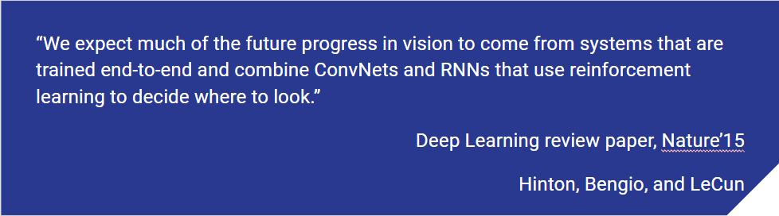

# Deep Reinforcement Learning in Computer Vision

[DRL in CV Website](https://bardofcodes.github.io/DRL_in_CV_Papers/)

**[Google Slides on this introduction](https://docs.google.com/presentation/d/1Nnt6Jj77SLECbeb3m_Y6lqDEH0t8CUePJt2U-HlT6ZM/edit?usp=sharing)**

In recent years, while use of Computer Vision techniques/models has burgeoned
for solving Reinforcement Learning task(such as games), the opposite flow, of
using techinques/models from Reinforcement Learning to solve paradigms in
Computer Vision has also been seen.

Additionally, from a few stalwarts of Computer Vision:

This indicates that just as researchers in Reinforcement learning benifited from
understanding and applying Computer vision techniques, researchers in
Computer Vision can benifit from not treating Reinforcement learning as an esoteric
black box and gaining a comprehensive understanding of this subject.

Hence, we are presenting a short series of lectures,(at our lab) with the following motivation:

# DRL in CV Papers
An Additional repository has been made [DRL_in_CV_Papers](https://github.com/BardOfCodes/DRL_in_CV_Papers), which consist of a list of published works in computer vision which use Deep Reinforcement learning. A few of the papers have an added blog-post on them as well, highlighting important parts of the paper.

# Posts
Additionally, for some topics which are important but might not have been a good slide presentation, we have made blog-like posts. This section will see further additions.
It is open for additional posts from all.Each post should contain the following information:
* title: The title of the post
* teaser: A small intro for the post
* author: The contributor's name
* type: keep it `post`
* addmath: True if you want to add equations to the post
* layout: 'post'

# Acknowledgement

We rely heavily on the following for the content. This work is mostly curation
of the excellant material already provided by these brilliant creators:

* Reinforcement Learning: An Introduction- Book by Andrew Barto and Richard S. Sutton.
[Link to latest draft](ufal.mff.cuni.cz/~straka/courses/npfl114/2016/sutton-bookdraft2016sep.pdf).
* UCL course on RL - Course by David Silver.[Link to material](http://www0.cs.ucl.ac.uk/staff/d.silver/web/Teaching.html).
* Code material from various amazing sources: [DannyBritz](https://github.com/dennybritz/reinforcement-learning),
[ShangtongZhang](https://github.com/ShangtongZhang/reinforcement-learning-an-introduction),
[AndrejKarapathy](https://github.com/karpathy/reinforcejs).

This work has been complied by Aditya Ganeshan and Trisha Mittal while working at [Video Analytics Lab(VAL),IISc](http://val.serc.iisc.ernet.in/valweb/). We thank the lab for giving us this opportunity.

## For the website:

* The template used for the website is [Solana](https://github.com/rlue/jekyll-solana). Thanks to [rlue](https://github.com/rlue) for this elegant yet friendly theme!
* For the Favicon, and a few other images, [Wordart.com](https://wordart.com/) and [LunaPic.com](https://www169.lunapic.com/editor/?action=transparent) were very useful.

