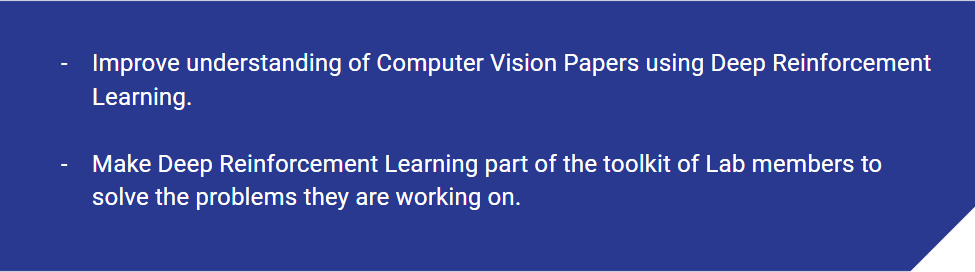

# Deep Reinforcement Learning in Computer Vision

**[Google Slides on this introduction](https://docs.google.com/presentation/d/1Nnt6Jj77SLECbeb3m_Y6lqDEH0t8CUePJt2U-HlT6ZM/edit?usp=sharing)**

In recent years, while use of Computer Vision techniques/models has burgeoned
for solving Reinforcement Learning task(such as games), the opposite flow, of
using techinques/models from Reinforcement Learning to solve paradigms in
Computer Vision has also been seen.

Additionally, from a few stalwarts of Computer Vision:

This indicates that just as researchers in Reinforcement learning benifited from
understanding and applying Computer vision techniques, researchers in
Computer Vision can benifit from not treating Reinforcement learning as an esoteric
black box and gaining a comprehensive understanding of this subject.

Hence, we are presenting a short series of lectures,(at our lab) with the following motivation:

## The Content Break-down

For a finer breakdown, kindly refer to the [google sildes](https://docs.google.com/presentation/d/1Nnt6Jj77SLECbeb3m_Y6lqDEH0t8CUePJt2U-HlT6ZM/edit?usp=sharing)

## Content for each Topic

We have roughly 12 major topics, and each topic contains:

* A reaveal.js based presentation on the topic, and

* A Tutorial on the topic in a Jupyter-Notebook(with solutions)

# Acknowledgement

We rely heavily on the following for the content. This work is mostly curation
of the excellant material already provided by these brilliant creators:

* Reinforcement Learning: An Introduction- Book by Andrew Barto and Richard S. Sutton.
[Link to latest draft](ufal.mff.cuni.cz/~straka/courses/npfl114/2016/sutton-bookdraft2016sep.pdf).
* UCL course on RL - Course by David Silver.[Link to material](http://www0.cs.ucl.ac.uk/staff/d.silver/web/Teaching.html).
* Code material from various amazing sources: [DannyBritz](https://github.com/dennybritz/reinforcement-learning),
[ShangtongZhang](https://github.com/ShangtongZhang/reinforcement-learning-an-introduction),
[AndrejKarapathy](https://github.com/karpathy/reinforcejs).
